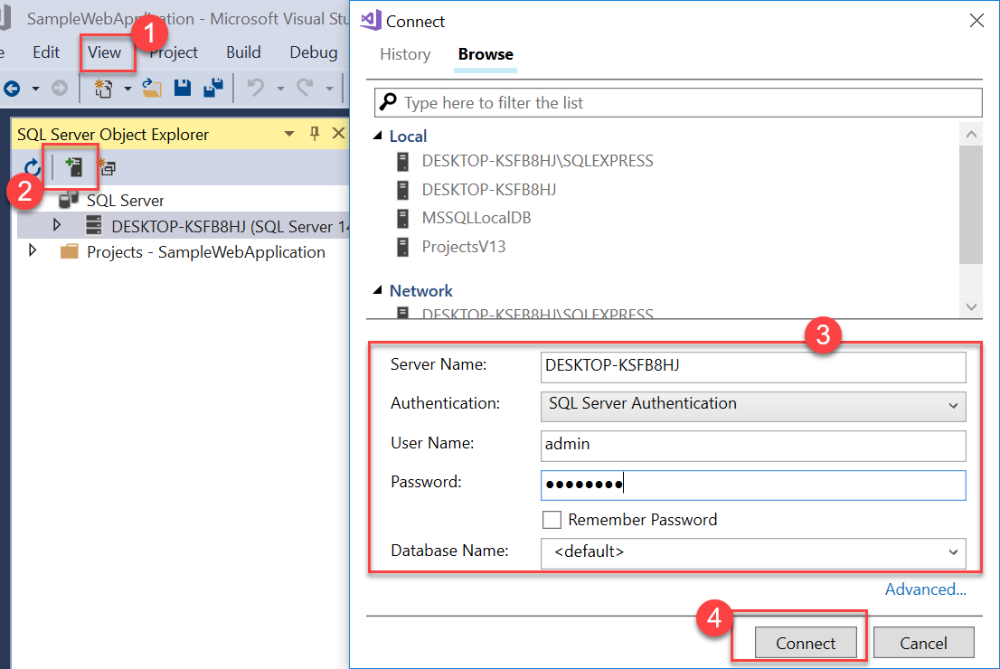
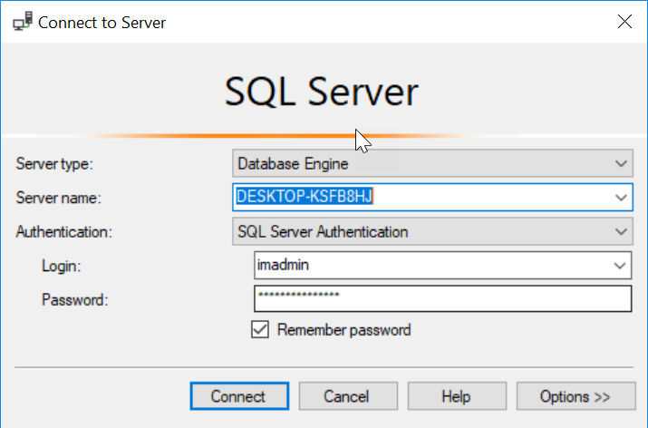

# SNP Cloud Workshop

Continuous delivery in Azure DevOps

Before the hands-on lab setup guide

January 2019

© 2019 SNP Technologies Inc. All rights reserved.

**Contents**

<!-- TOC -->

- [Continuous delivery in Azure DevOps before the hands-on lab setup guide for on-premise IIS and SQL](#continuous-delivery-in-azure-devops-before-the-hands-on-lab-setup-guide-for-on-premise-iis-and-sql)
  - [Requirements](#requirements)
  - [Before the hands-on lab](#before-the-hands-on-lab)
    - [Prerequisites](#prerequisites)
    - [Task 1: Configure a development environment](#task-1-configure-a-development-environment)
    - [Task 2: Disable IE enhanced security](#task-2-disable-ie-enhanced-security)
    - [Task 3: Validate connectivity to SQL database](#task-3-validate-connectivity-to-sql-database)

<!-- /TOC -->

# Continuous delivery in Azure DevOps before the hands-on lab setup guide for on-premise IIS and SQL

## Requirements

1.  Microsoft Azure DevOps organisation and accounts.

2.  Client - For developer - Local machine or a server configured with: 

    -   Visual Studio Community 2017
    
    -   SQL Server Management Studio (Optional)

2.  Servers - For hosting/deployment - Local machine or a server configured with:

    -   Powershell with Administrator privileges
    
    -   IIS
    
    -   SQL Server (Same/Different machine)

## Before the hands-on lab

Duration: 30 minutes

In this lab, you will create a developer environment and download the required files for this course if you do not already have one that meets the requirements.

### Prerequisites

-   Microsoft Azure Devops account <https://azure.microsoft.com/en-in/services/devops/>

-   Client computer with Windows 7 or later with Visual Studio 2017

### Task 1: Configure a development environment

If you do not have a machine setup with Visual Studio 2017 Community, complete this task.

1.  At the Azure web portal, create a virtual machine in Azure using the Visual Studio Community 2017 on Windows Server 2016 image.

    

    > It is **highly** recommended to use a DS2_v2 or D2s_v3 instance size for this VM.

    > You will also need to make sure to enable RDP (port 3389) inbound access to the VM.

### Task 2: Disable IE enhanced security

>**Note:** Sometimes this image has IE ESC disabled, and sometimes it does not.

1.  On the new VM, you just created click the Server Manager icon.

    

    Click Local Server.

    

2.  On the right side of the pane, click **On** by IE Enhanced Security Configuration.

    

3.  Change to **Off** for Administrators, and click **OK**.

    

### Task 3: Validate connectivity to SQL database

1.  From within the virtual machine, Launch Visual Studio 2017 and validate that you can login with your Microsoft Account when prompted.

  - Launch Visual Studio, open SQL Server Object Explorer from the View menu, and ensure you can connect to your SQL server using SQL authentication.
  
    

2. Launch SQL Server Management Studio, ensure you can connect to your SQL server using SQL authentication.

    

**Download the exercise files**

1.  Download the exercise files for the training (from within the virtual machine).

    -   Create a new folder on your computer named **C:\\Hackathon**.

    -   Download the support files (.zip format), https://improjectfilescw.blob.core.windows.net/countrywidedemoproject/CWdemo.zip to the new folder.

    -   Extract the contents to the **C:\\Hackathon** folder.

You should follow all steps provided *before* attending the hands-on lab.
